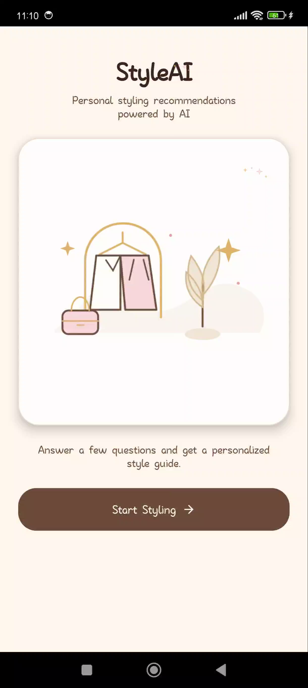
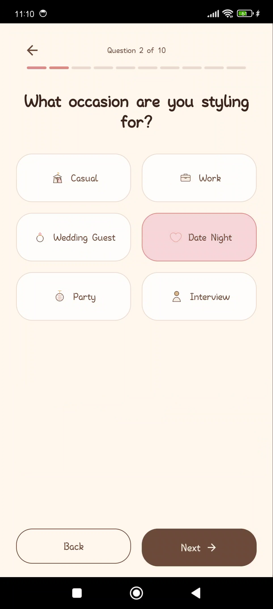
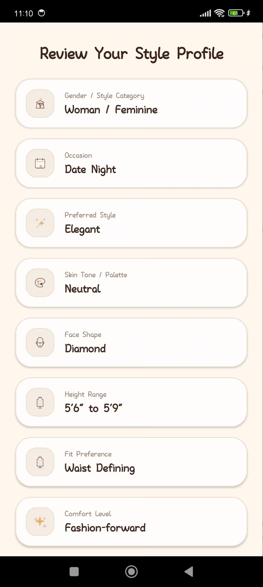
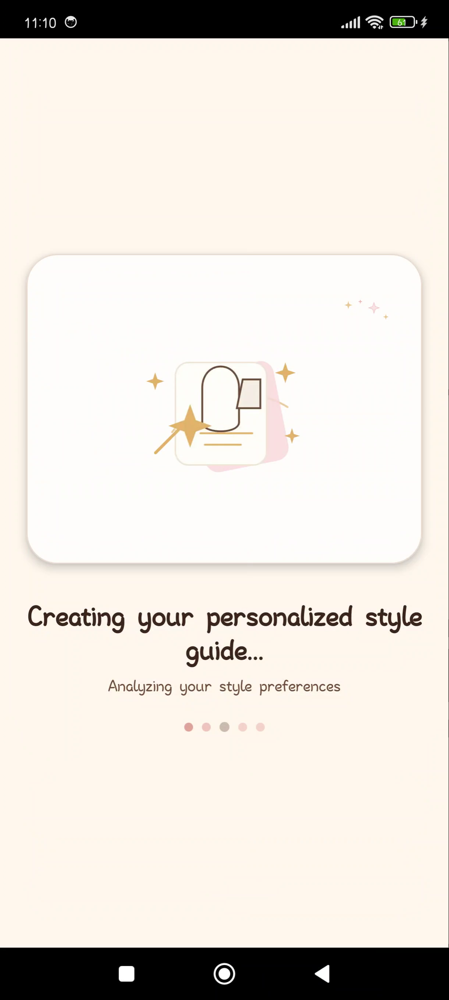
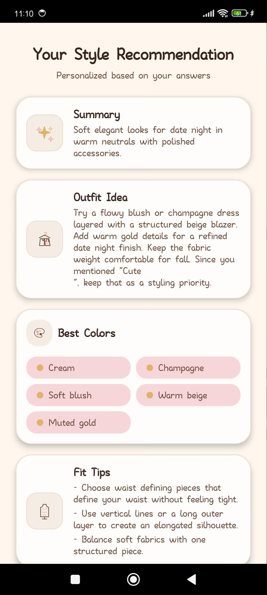

# StyleAI

StyleAI is a Kotlin Multiplatform mobile portfolio MVP that collects a short styling questionnaire and displays personalized AI styling recommendations.

This project is intentionally scoped as a portfolio MVP, not a production application. It demonstrates mobile architecture, API integration, structured AI output, local LLM usage, and graceful fallback behavior without external AI providers, authentication, or persistent backend storage.

## Project Overview

The mobile app asks users about their occasion, preferred style, skin tone, face shape, height range, fit preference, comfort level, budget, season, and optional notes. The answers are sent to a Spring Boot backend, which uses a local AI pipeline to generate a structured styling response.

The mobile app does not call OpenAI, Gemini, Claude, or Ollama directly. It calls the backend endpoint:

```http
POST /api/style/recommend
```

The backend owns the AI workflow:

```text
StyleAI Agent -> rule-based tools -> styling knowledge base -> Ollama local LLM -> structured JSON response
```

## Screenshots

| Welcome | Questionnaire | Review |
| --- | --- | --- |
|  |  |  |

| Loading | Result |
| --- | --- |
|  |  |

## Demo Video

[Watch the StyleAI demo video](https://drive.google.com/file/d/1QbK6uNv6gdTQWv64fT-TF3AFeyL9jkvC/view?usp=sharing)

## Features

- Kotlin Multiplatform mobile app.
- Compose Multiplatform UI.
- Multi-step styling questionnaire.
- Review screen before generation.
- Personalized styling recommendation result screen.
- Ktor Client integration for backend calls.
- kotlinx.serialization request and response models.
- Repository pattern for swapping data sources.
- Fake repository for previews, local testing, and fallback demos.
- Remote repository for real Spring Boot backend calls.
- Structured JSON response rendered by the UI.
- Local AI backend with no external AI APIs.
- Error state for failed recommendation requests.

## AI System Architecture

```text
KMP Mobile UI
-> Questionnaire State
-> RemoteStyleRepository
-> Ktor Client
-> Spring Boot API
-> StyleAI Agent
-> Rule-Based Tools
-> Styling Knowledge Base
-> Ollama Local LLM
-> Structured JSON Response
-> Result Screen
```

The AI system is designed so the mobile app stays simple and provider-agnostic. The app submits user preferences and receives a predictable JSON object. Prompting, tool logic, knowledge lookup, Ollama interaction, and response shaping happen on the backend.

## Mobile Architecture

The mobile app is organized around shared Kotlin Multiplatform modules:

- `android`: Android application entry point.
- `core:app`: app-level Compose UI and navigation.
- `core:features:main`: StyleAI questionnaire, review, loading, error, and result screens.
- `core:models`: serializable request, response, and UI models.
- `core:data`: repository interfaces and implementations.
- `core:network`: Ktor API client and backend endpoint configuration.
- `core:designSystem`: shared theme and UI components.
- `core:ui`: shared UI state helpers.

Important mobile classes:

- `StyleRepository`: shared repository contract.
- `RemoteStyleRepository`: calls the backend through Ktor.
- `FakeStyleRepository`: returns deterministic sample recommendations for previews/testing.
- `StyleAiRemoteApi`: Ktor-based API client.
- `StyleRequest`: questionnaire payload.
- `StyleResponse`: structured recommendation response.

## Backend Architecture

The backend is a Kotlin Spring Boot service responsible for the AI workflow.

It uses:

- Spring Boot and Kotlin.
- A local Ollama model.
- A StyleAI agent layer.
- Rule-based tools for deterministic styling logic.
- A JSON styling knowledge base.
- Structured JSON responses.
- No external AI APIs.
- No authentication.
- No database.

Backend request flow:

```text
POST /api/style/recommend
-> validate questionnaire payload
-> run StyleAI Agent
-> apply rule-based styling tools
-> retrieve relevant styling knowledge
-> call local Ollama model
-> normalize output into StyleResponse JSON
-> return response to mobile app
```

## API Documentation

### Generate Styling Recommendation

```http
POST /api/style/recommend
Content-Type: application/json
```

Creates a personalized styling recommendation from questionnaire answers.

### Request Body

| Field | Type | Description |
| --- | --- | --- |
| `genderStyleCategory` | `String` | Styling category selected by the user. |
| `occasion` | `String` | Event or situation the outfit is for. |
| `preferredStyle` | `String` | User's preferred style direction. |
| `skinTone` | `String` | Skin tone category used for color suggestions. |
| `faceShape` | `String` | Face shape used for styling and grooming tips. |
| `heightRange` | `String` | Height range used for fit and silhouette tips. |
| `fitPreference` | `String` | Preferred fit, such as relaxed or tailored. |
| `comfortLevel` | `String` | Comfort preference for the outfit. |
| `budget` | `String` | Budget range for recommendations. |
| `season` | `String` | Seasonal context. |
| `notes` | `String` | Optional free-form user notes. |

### Response Body

| Field | Type | Description |
| --- | --- | --- |
| `summary` | `String` | Short overview of the recommendation. |
| `outfitIdea` | `String` | Main outfit suggestion. |
| `colorsToTry` | `List<String>` | Recommended colors. |
| `colorsToAvoid` | `List<String>` | Colors to avoid or use carefully. |
| `fitTips` | `List<String>` | Fit and silhouette advice. |
| `accessories` | `List<String>` | Accessory suggestions. |
| `footwear` | `String` | Shoe recommendation. |
| `hairAndGrooming` | `String` | Hair and grooming suggestion. |
| `budgetTips` | `List<String>` | Budget-aware shopping advice. |
| `confidenceBoost` | `String` | Positive closing recommendation. |

### Health Check

```http
GET /api/health
```

Returns a simple backend health message.

## Example Request/Response

### Request

```json
{
  "genderStyleCategory": "Feminine",
  "occasion": "Wedding guest",
  "preferredStyle": "Elegant",
  "skinTone": "Warm",
  "faceShape": "Oval",
  "heightRange": "5'3 - 5'6",
  "fitPreference": "Tailored",
  "comfortLevel": "Comfortable but polished",
  "budget": "Mid-range",
  "season": "Spring",
  "notes": "I prefer soft colors and want something easy to rewear."
}
```

### Response

```json
{
  "summary": "A soft elegant wedding guest look built around warm neutrals, polished tailoring, and reusable pieces.",
  "outfitIdea": "Try a champagne or blush midi dress with a structured beige blazer. Add warm gold accents and keep the silhouette clean for a polished spring look.",
  "colorsToTry": [
    "Champagne",
    "Soft blush",
    "Warm beige",
    "Muted gold"
  ],
  "colorsToAvoid": [
    "Harsh neon tones",
    "Very cool gray"
  ],
  "fitTips": [
    "Choose tailored pieces that define the waist without feeling tight.",
    "Use a longer outer layer to create a clean vertical line.",
    "Balance soft fabric with one structured piece."
  ],
  "accessories": [
    "Minimal gold earrings",
    "Structured small handbag",
    "Delicate bracelet"
  ],
  "footwear": "Nude, beige, or blush heels will keep the look refined and lengthening.",
  "hairAndGrooming": "Soft waves or a clean bun will match the elegant styling direction.",
  "budgetTips": [
    "Invest in one well-made neutral blazer.",
    "Use accessories to elevate simple outfits.",
    "Choose shoes that can work across multiple occasions."
  ],
  "confidenceBoost": "The strongest outfit is one that feels comfortable, polished, and true to your personality."
}
```

## Setup Instructions

### Prerequisites

- Android Studio or IntelliJ IDEA with Kotlin Multiplatform support.
- JDK 17 or newer.
- Android SDK installed.
- Ollama installed locally.
- Spring Boot backend project available locally.
- A local Ollama model pulled and running.

Clone the mobile project:

```bash
git clone https://github.com/PhoenixIgris/StyleAi.git
cd StyleAi
```

Sync the Gradle project in Android Studio before running the app.

## How to Run Ollama

Install Ollama from:

```text
https://ollama.com
```

Pull a local model:

```bash
ollama pull llama3.1
```

Start Ollama:

```bash
ollama serve
```

In another terminal, verify the model works:

```bash
ollama run llama3.1
```

The Spring Boot backend should call Ollama locally. The mobile app should not call Ollama directly.

## How to Run Backend

From the Spring Boot backend project directory:

```bash
./gradlew bootRun
```

The backend should expose:

```text
http://localhost:8080
```

Verify the health endpoint:

```bash
curl http://localhost:8080/api/health
```

Test the recommendation endpoint:

```bash
curl -X POST http://localhost:8080/api/style/recommend \
  -H "Content-Type: application/json" \
  -d '{
    "genderStyleCategory": "Feminine",
    "occasion": "Wedding guest",
    "preferredStyle": "Elegant",
    "skinTone": "Warm",
    "faceShape": "Oval",
    "heightRange": "5'\''3 - 5'\''6",
    "fitPreference": "Tailored",
    "comfortLevel": "Comfortable but polished",
    "budget": "Mid-range",
    "season": "Spring",
    "notes": "I prefer soft colors."
  }'
```

## How to Run Mobile App

From the mobile project root:

```bash
./gradlew :android:assembleDebug
```

Or open the project in Android Studio and run the `android` app configuration.

For local development, run services in this order:

1. Start Ollama.
2. Start the Spring Boot backend.
3. Start the Android app.
4. Complete the questionnaire and generate a recommendation.

## Android Emulator Note

Android emulators cannot reach your computer's `localhost` through `http://localhost:8080`.

Use:

```text
http://10.0.2.2:8080
```

This maps the Android emulator back to the host machine. If the backend runs on a different port, update the mobile backend base URL to match that port.

## Error Handling and Fallback Mode

The app separates real backend calls from fake local responses through the repository pattern.

- `RemoteStyleRepository` calls the Spring Boot backend.
- `FakeStyleRepository` returns a local sample recommendation.

If the backend is unavailable, times out, or returns an invalid response, the UI moves into an error state instead of crashing. For portfolio demos, the fake repository can be used to show the full questionnaire and result flow without requiring Ollama or the backend to be running.

This MVP does not include offline persistence, retries, authentication recovery, or production monitoring.

## What I Learned

- Building shared mobile UI with Kotlin Multiplatform and Compose Multiplatform.
- Modeling UI state for a multi-step questionnaire.
- Using Ktor Client with kotlinx.serialization for typed API calls.
- Keeping the mobile app independent from specific AI providers.
- Designing a backend-owned AI workflow with a structured JSON contract.
- Combining rule-based tools, a styling knowledge base, and a local LLM.
- Creating a fake repository to support previews, testing, and demo fallback.
- Handling loading, success, and error states cleanly in a portfolio MVP.

## Future Improvements

- Add real screenshots and a demo video.
- Add backend tests for the StyleAI Agent and rule-based tools.
- Add contract tests for `StyleRequest` and `StyleResponse`.
- Add richer questionnaire branching.
- Add image-based style inputs.
- Add saved style profiles.
- Add user authentication.
- Add a database for recommendation history.
- Add retry behavior and better backend diagnostics.
- Add deployment instructions for a hosted backend.
- Add CI checks for linting, tests, and builds.

## Portfolio Highlights

- End-to-end Kotlin project across mobile and backend layers.
- Kotlin Multiplatform architecture with shared models and UI logic.
- Compose Multiplatform screens for a complete MVP user flow.
- Repository pattern with fake and remote implementations.
- Ktor Client integration with structured serialization.
- Spring Boot backend that hides AI orchestration from the client.
- Local Ollama integration with no external AI API dependency.
- Rule-based agent design backed by a JSON styling knowledge base.
- Structured AI response contract that the UI can render predictably.
- Clear separation between portfolio MVP scope and production concerns.

## License

This project is currently shared as a portfolio MVP. Add a license file before distributing, reusing, or accepting contributions.

Suggested license for open-source portfolio use:

```text
MIT License
```
